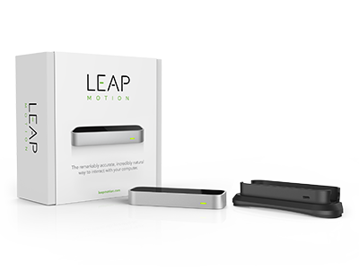
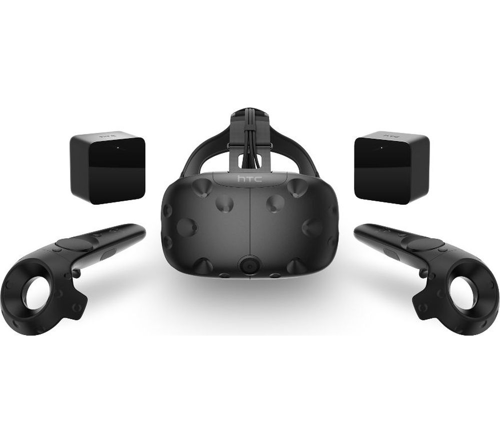
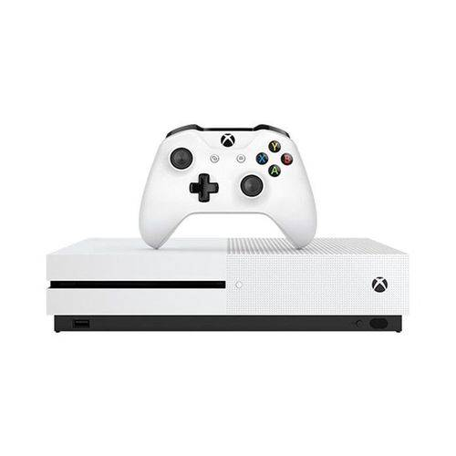
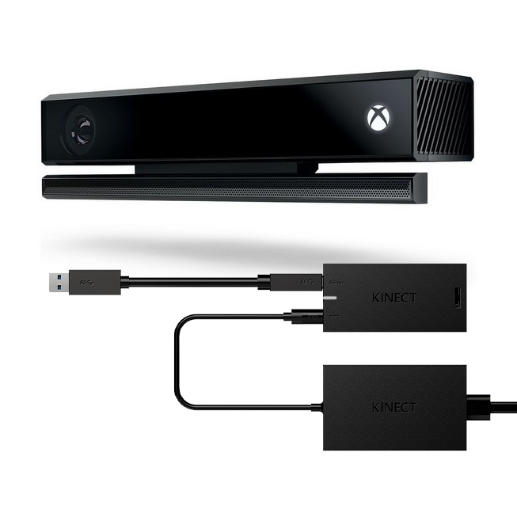
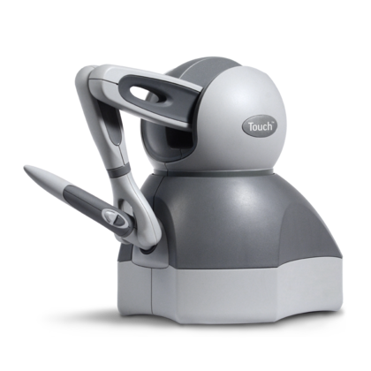
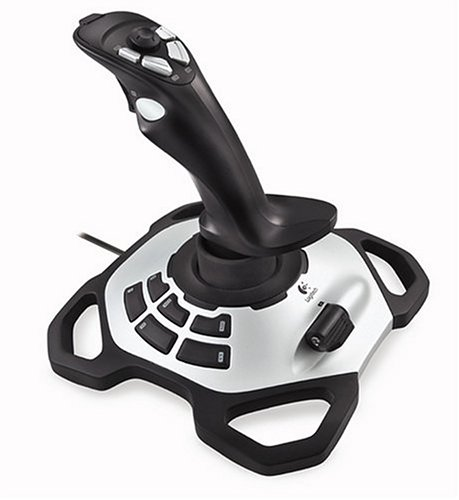

\tableofcontents
\clearpage

# Leap Motion

Sistema para _tracking_ de mãos para aplicações em realidade virtual e aumentada.

No site oficial é possivel encontrar exemplos de aplicações e o SDK.

[Site oficial Leap Motion](https://www.leapmotion.com/)

[Showcases](https://community.leapmotion.com/showcase/)

[Documentação](https://developer.leapmotion.com/documentation/)

\pagebreak

# HTC Vive/Pro

Sistema de Realidade virtual, desenvolvido pela HTC junto a Valve. Sua tecnologia de restreamento permite o usuário se mover no espaço 3D com movimentação real.

Temos disponivel em nosso laboratorio 16 kits (14 Vive + 2 Vive Pro).

O Kit consiste em:

- 1 Headset
- 2 Joysticks
- 2 BaseStations 1.0 (Em nosso laboratório temos Base Stations fixas para facilitar o uso dos aparelhos)
- 1 Linkbox (USB,HDMI,POWER,MD/USB,MD,POWER)

\pagebreak

# X Box One

Console de oitava geração utilizado para testes de aplicações para o console.

\pagebreak

# Kinect

Dipositivo de captura de movimento utilizando tecnologia infravermelho e nuvem de pontos

[Utilizando Kinect com Autodesk Motion Builder](https://knowledge.autodesk.com/support/motionbuilder/learn-explore/caas/CloudHelp/cloudhelp/2017/ENU/MotionBuilder/files/GUID-60A372EC-154D-402A-B56F-DC41FE3FF41F-htm.html)

[Utilizanddo Kinect com Ipi Soft](http://docs.ipisoft.com/Quick_Start_Guide_for_Single_Depth_Sensor_Configuration)

\pagebreak

# Volante Thrustmaster com Force Feedback

O sistema de acionamento com efeitos Force Feedback ajustáveis permitem-lhe sentir cada detalhe enquanto conduz  (o relevo da estrada ou da pista, perda de aderência dos pneus, travagens, solavancos e impactos, etc.).

Ângulo de rotação ajustável de 270° a 900°!

Volante de alta precisão: leitura ótica com resolução de 12 bits (ou seja, 4.096 valores no eixo de direção do volante)

Sistema misto de polia/correia e engrenagens (mais suave, mais fluido e menos ruidoso do que as rodas helicoidais) com eixo metálico de rolamento de esferas (para uma maior robustez)

Memória interna e firmware atualizável

Sistema de fixação robusto e versátil, compatível com todas as montagens (secretárias, mesas, etc.)

[Documentação para volante e force feedback](https://docs.microsoft.com/pt-br/windows/uwp/gaming/racing-wheel-and-force-feedback)

\pagebreak

# 3DSystems Touch

Touch é um dispositivo motorizado que aplica _force feedback_ à mão do usuário, permitindo assim uma sensação de toque de objetos virtuais.

Soluções podem ser projetadas utilizando o sistema háptico, para conseguir resultados mais imersivos.

Ele pode ser utilizado em aplicações como: Simulações, treinamentos, controle robótico entre outras IHC.

[Galeria de Aplicações do Touch](https://www.3dsystems.com/haptics-devices/touch/customer-stories)

\pagebreak

# Logitech Extreme 3d Pro Manche

_Joystic_ tipo manche com 12 botões de ações diversas para testes de aplicações.

[Programando para simuadores de Voo](https://docs.microsoft.com/pt-br/windows/uwp/gaming/flight-stick)

\pagebreak

# Hololens 1.0

O Microsoft HoloLens é feito de componentes especializados que juntos permitem a computação holográfica. O sistema ótico funciona em passo a passo com sensores avançados. A Unidade de Processamento Holografico (HPU) facilita o processamento de uma grande quantidade de dados por segundo. Todos esses componentes permitem que você se mova livremente e interaja com os hologramas.

[Detalhes do hardware](https://docs.microsoft.com/en-us/windows/mixed-reality/hololens-hardware-details)

[Criando seu primeiro projeto em Realidade Mista](https://docs.microsoft.com/en-us/windows/mixed-reality/holograms-100)

\pagebreak
